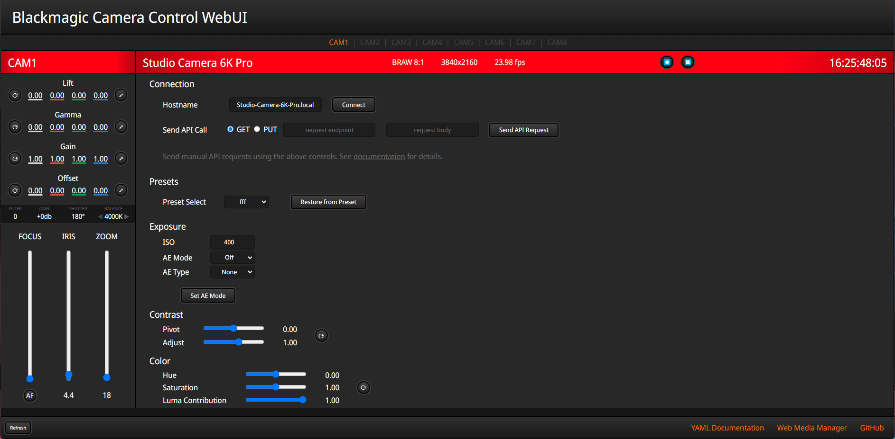
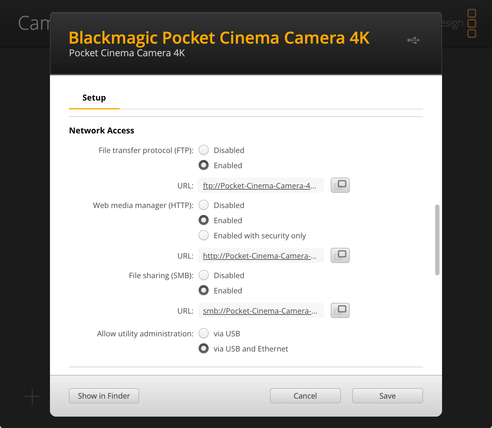
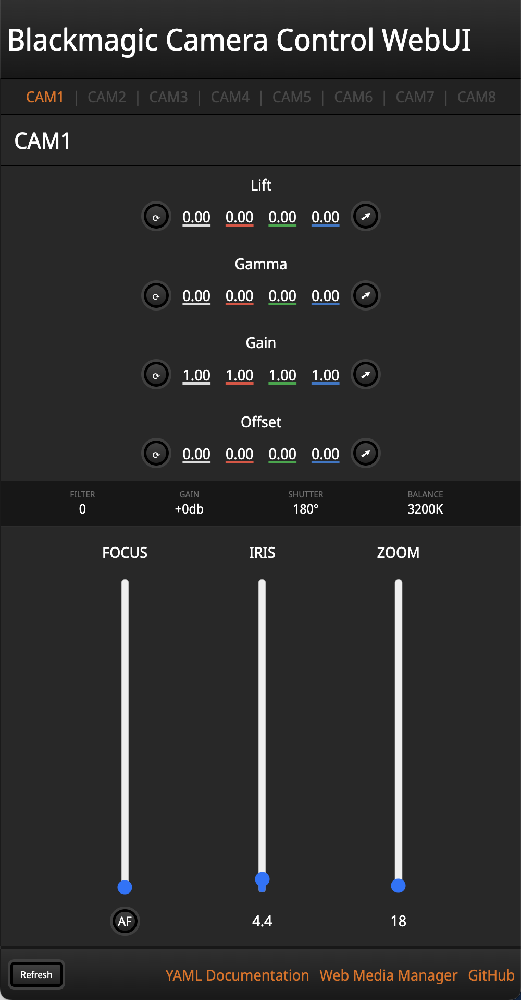

# BM Camera Control WebUI
This web app utilizes the [Blackmagic](https://blackmagicdesign.com) Camera Control REST API to control cameras with a vanilla JS web interface. Modeled after the interface of ATEM Software Control, most of the camera's functions that can be controlled by the API are available here.

Note that this is a tech demo, and may not be suitable for production use.

>This program was written based on the official REST API documentation from Blackmagic, which can be found [here](https://documents.blackmagicdesign.com/DeveloperManuals/RESTAPIforBlackmagicCameras.pdf)

Using this tool, you can control your Blackmagic studio and cinema cameras *without any extra hardware!* Use it for remote monitoring, color correction, focus pulling, or keeping tabs on your eqiupment.

The `BMDevice.js` file works on its own if you want to write your own web app using the REST API. If you're interested in an in-depth walkthrough, I have a series of tutorials where I build up this file, step by step, while explaining how each part works. You can find it on my [GitHub page for it](https://github.com/DylanSpeiser/BM-API-Tutorial).



# Getting Started

## Camera Setup
In order for the camera's API to be active, network connectivity must be enabled in **Blackmagic Camera Setup**, and the camera should be connected to the same network as your computer with an ethernet cable.
<br>
If your camera does not have an ethernet port, use a USB-C to ethernet adapter.

>Make sure that your camera has been updated to the latest firmware! (8.6+)



> If you're using the GitHub Pages site, the API must be accessed with HTTPS rather than HTTP. You can enable this on the camera in **Blackmagic Camera Setup** by clicking the "Generate Certificate" button.

## Launching the App
The app is a self-contained, offline web page. (No installation, dependencies, or servers to worry about!) Simply open the `index.html` file in your browser of choice, enter the hostname of your camera, and press "Connect".

You can also use the GitHub Pages version of the app, which is linked in the sidebar.

If you don't know the hostname of your camera, you can find and/or change it in **Blackmagic Camera Setup**.
<br>
(The hostname is the camera's name with spaces replaced with dashes, and `.local` appended to the end)

# Using the App

### Arrows, Buttons, and Text Boxes
Many controls work with sliders/buttons as well as manual input by clicking on the number and typing in a new value.

### Media Management
To view files on the drives of your camera, follow the link in the bottom-right corder for the **Web Media Manager**. This will take you to *your camera's* internal web server where you can view, download, and upload video files over the network.

### Manual API Calls
The page allows for the sending of manual API calls to the camera. Use the text boxes to do that, after consulting the documentation.

### Layout
Because the app is just a web page, you can open it in multiple browser windows at once. Resize the windows and you can monitor many cameras at the same time!



### Data Synchronization
The app uses WebSockets to keep itself updated with the latest info from the camera. If something has gone wrong, refresh the page.

I have done my best to make the page responsive, but every screen is different. If something looks off, adjust the zoom/scale of the window in your browser and that should fix things.

# Compatibility
This app (as of June 2024), should be compatible with the following Blackmagic cameras:
| Camera Name | Default Hostname | Notes |
|-|-|-|
| Pocket Cinema Camera 4K | `Pocket-Cinema-Camera-4K.local` | FW 8.6+ Required |
| Pocket Cinema Camera 6K | `Pocket-Cinema-Camera-6K.local` | FW 8.6+ Required |
| Pocket Cinema Camera 6K G2 | `Pocket-Cinema-Camera-6K-G2.local` | FW 8.6+ Required |
| Pocket Cinema Camera 6K Pro | `Pocket-Cinema-Camera-6K-Pro.local` | FW 8.6+ Required |
| Cinema Camera 6K | `Blackmagic-Cinema-Camera-6K.local` | |
| URSA Broadcast G2 | `URSA-Broadcast-G2.local` | |
| Micro Studio Camera 4K G2 | `Micro-Studio-Camera-4K-G2.local` | |
| Studio Camera 4K Plus | `Studio-Camera-4K-Plus.local` | |
| Studio Camera 4K Pro | `Studio-Camera-4K-Pro.local` | |
| Studio Camera 4K Plus G2 | `Studio-Camera-4K-Plus-G2.local`$^1$ | |
| Studio Camera 4K Pro G2 | `Studio-Camera-4K-Pro-G2.local`$^1$ | |
| Studio Camera 6K Pro | `Studio-Camera-6K-Pro.local` | |

$^1:$ Unverified best guess <br>
If any of this information is incorrect, please let me know in the Issues section of this repository.

# The Code
It's open source, so feel free to modify the code to add new features or suit it to your setup. It's all vanilla JavaScript and HTML so it's super easy to work with and modify. Fork it and make something cool!
<br><br>
If you like this project and want it to improve, consider making a Pull Request and I'll give it a look. Or, if coding isn't your thing, open an Issue in the repo's issue tracker.

## Tutorials
For more information about using the BMD REST API and how I wrote `BMDevice.js`, check out [my tutorial series](https://github.com/DylanSpeiser/BM-API-Tutorial/) that explains the basics of how to interact with the camera in JavaScript and Python.

## Using `BMDevice.js`

### Basic Use
You are more than welcome to use this JavaScript class in your own projects. Just include the file (with its attributions).

Cameras are represented as BMCamera objects, instantiated with the `new` keyword and the constructor, which takes the hostname as a String argument. The constructor also (optionally) takes another boolean argument for whether or not to use HTTPS and WSS requests rather than their unsecre counterparts. In order to use the secure protocols, you must generate a certificate in **Blackmagic Camera Setup**.

If you are using this file to control a HyperDeck, instantiate it as a `BMDevice` object.

### Updating the UI
After instantiation, the constructor automatically subscribes to and pulls data from every available WebSocket property. If you don't like this, comment out lines 93-98 of `BMDevice.js`.

Each BMDevice object has an `active` property, whose sole purpose is to enable or disable the calling of `updateUI` after receiving a WebSocket message. By default, `active` is set to `false`. If you have your own UI and want to update it on every `ws.onmessage` event (like I do), after instantiating the device, pass a reference to _your_ UI updating function to `.updateUI` and set `active` to true, like so:

```JS
cameras[ci] = new BMCamera(hostname);

cameras[ci].updateUI = updateUIAll;

cameras[ci].active = true;
```

### Accessing Data

The JSON data from the device is stored in the `propertyData` field, indexed by the endpoint it came from. For example, here's how you would access the recording state of a `BMDevice` object named `device`:

```JS
device.propertyData['/transports/0/record'].recording
```

Remember to consult the REST API documentation for more information about how this data is stored. Or, look in the developer console for this WebUI. You can access the currently selected camera in my WebUI as `cameras[ci]`.

### Sending Data

Data is sent to the camera with the `PUTdata(endpoint, data)` method. For example:

```JS
camera.PUTdata("/video/whiteBalance",{whiteBalance: 3200});
```

`JSON.stringify()` is called on the `data` parameter before sending.

This file is heavily commented so everything _should_ be pretty clear, but let me know in the Issue tracker if you're having trouble.

# Issues and To-Dos

Please report issues to the repo's issue tracker so I can fix them!

If you're having trouble and don't know why, check the browser console.

## To-Do
- Make a better UI for color correction
- Add more functionality to vertical layout
- Add audio settings
- Add codec/format switching settings
- Improve responsiveness
- Improve error handling
- Save / download preset files to/from the camera

### For License and Copyright details, See `LICENSE.txt`
(c) 2024 Dylan Speiser
<br>
Licensed under the GNU General Public License
