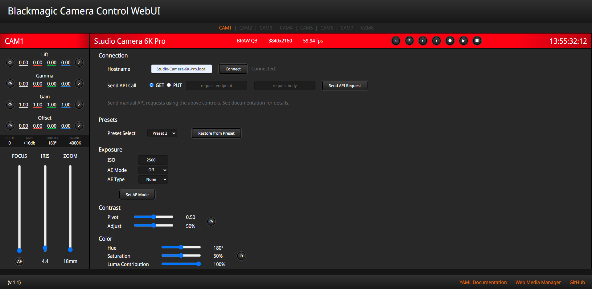

# BM Camera Control WebUI
This web app is utilizes the [Blackmagic](https://blackmagicdesign.com) Camera Control REST API to control cameras via an extensible web interface. Modeled after the interface of ATEM Software Control, most of the camera's functions that can be controlled by the API are available here.

>This program was written based on the official REST API documentation from Blackmagic, which can be found [here](https://documents.blackmagicdesign.com/DeveloperManuals/RESTAPIforBlackmagicCameras.pdf)

Using this tool, you can control your Blackmagic studio and cinema cameras *without any extra hardware!* Use it for remote monitoring, color correction, focus pulling, or keeping tabs on your eqiupment. The `BMD-Camera-Control.js` file is also useful if you want to write your own web app using the REST API. More details on how to interface with it can be found below.

# Getting Started

## Camera Setup
In order for the camera's API to be active, network connectivity must be enabled in **Blackmagic Camera Setup**, and the camera should be connected to the same network as your computer with an ethernet cable.
 
If your camera does not have an ethernet port, use a USB-C to ethernet adapter.

>Make sure that your camera has been updated to the latest firmware! (8.6+)

## Launching the App
The app is a self-contained, offline web page. (No installation, dependencies, or Node.js installations to worry about!) Simply open the `index.html` file in your browser of choice, enter the hostname of your camera, and press "Connect".
  
If you don't know the hostname of your camera, you can find and/or change it in **Blackmagic Camera Setup**.
 
(The hostname is the camera's name with spaces replaced with dashes, and `.local` appended to the end)
  
Not all camera and lens combinations are supported by the API (Some cameras have ND filters, some don't. Some electronic zoom lenses work, some don't.)

# Using the App

### Data Synchronization
The app polls data from the camera every ten seconds (you'll see "Refreshing..." in the corner). When you change a setting in the browser, it relays that to the camera and verifies the change. If you make a change that reverts after a few seconds, that means the camera rejected it. The page can be manually refreshed with the button in the bottom left corner.

### Arrows, Buttons, and Text Boxes
Many controls work both with sliders/buttons, but if you want to enter a specific value then click on the number and enter the value manually.

### Media Management
To view files on the drives of your camera, follow the link in the bottom-right corder for the **Web Media Manager**. This will take you to *your camera's* internal web server where you can view, download, and upload video files over the network.

### Manual API Calls
The page allows for the sending of manual API calls to the camera. Use the text boxes to do that, after consulting the documentation.

### Layout
Because the app is just a web page, you can open it in multiple browser windows at once. Resize the windows and you can monitor many cameras at the same time!

I have done my best to make the page responsive, but every screen is different. If something looks off, adjust the zoom/scale of the window in your browser and that should fix things.

# Compatibility
This app (as of June 2024), should be compatible with the following Blackmagic cameras:
| Camera Name | Default Hostname | Notes |
|-|-|-|
| Pocket Cinema Camera 4K | `Pocket-Cinema-Camera-4K.local` | FW 8.6+ Required |
| Pocket Cinema Camera 6K | `Pocket-Cinema-Camera-6K.local` | FW 8.6+ Required |
| Pocket Cinema Camera 6K G2 | `Pocket-Cinema-Camera-6K-G2.local` | FW 8.6+ Required |
| Pocket Cinema Camera 6K Pro | `Pocket-Cinema-Camera-6K-Pro.local` | FW 8.6+ Required |
| Cinema Camera 6K | `Blackmagic-Cinema-Camera-6K.local` | |
| URSA Broadcast G2 | `URSA-Broadcast-G2.local` | |
| Micro Studio Camera 4K G2 | `Micro-Studio-Camera-4K-G2.local`$^1$ | |
| Studio Camera 4K Plus | `Studio-Camera-4K-Plus.local` | |
| Studio Camera 4K Pro | `Studio-Camera-4K-Pro.local` | |
| Studio Camera 4K Plus G2 | `Studio-Camera-4K-Plus-G2.local`$^1$ | |
| Studio Camera 4K Pro G2 | `Studio-Camera-4K-Pro-G2.local`$^1$ | |
| Studio Camera 6K Pro | `Studio-Camera-6K-Pro.local` | |

$^1:$ Unverified best guess  
If any of this information is incorrect, please let me know in the Issues section of this repository.

# The Code
It's open source, so feel free to modify the code to add new features or suit it to your setup. (Just don't sell it, okay?) It's all vanilla JavaScript and HTML so it's super easy to work with and modify. Fork it and make something cool!
  
If you like this project and want it to improve, consider making a Pull Request and I'll give it a look. Or, if coding isn't your thing, open an Issue in the repo's issue tracker.

## Using `BMD-Camera-Control.js`
You are more than welcome to use this JavaScript class in your own projects. Just include the file (with its attributions).
  
Cameras are represented as BMDCamera objects, instantiated with the `new` keyword and the constructor, which takes the hostname as a String argument.
  
After instantiation, the constructor does NOT automatically fetch any data from the camera. This can be done using the `getAllInfo()` method, or the individual getters if you only need a few details. These are all asynchronous and so must be waited upon using `await` or `.then()`. Consult your nearest Google search bar for help implementing asynchronous JavaScript, that's how I did it.
  
Many of setter functions take Objects as arguments, rather than Strings or ints. Consult the comments and the REST API documentation for details. Many also have integrated waiting periods before fetching the result of the operation and updating the UI. This is to give the camera time to physically respond to the command.
  
This file is heavily commented so everything _should_ be pretty clear, but let me know in the Issue tracker if you're having trouble.

## BYOUI
If you want to use `BMD-Camera-Control.js` in your own UI, there are static references to functions in the BMDCamera class that get called after changing a value. They all look like `updateUIxxxxxx()`. Set these references to point to your UI updating routines in _your_ source file. No need to write them in `BMD-Camera-Control.js`.

# Issues and To-Dos
## Known Issues
- Page responsiveness
- Sometimes the refresh happens while you're typing in a text field and replaces what you've typed

## Unknown Issues
Please report issues to the repo's issue tracker so I can fix them!
 
If you're having trouble and don't know why, check the browser console.

## To-Do
- Use WebSockets instead of polling to keep the page in sync
- Make a better UI for color correction
- Add audio settings
- Add codec/format switching settings
- Improve responsiveness
- Improve error handling
- Save / download preset files to/from the camera
- Code cleanup (once I learn better web design lol)

### For License and Copyright details, See `LICENSE.txt`
(c) 2024 Dylan Speiser
 
Licensed under the GNU General Public License